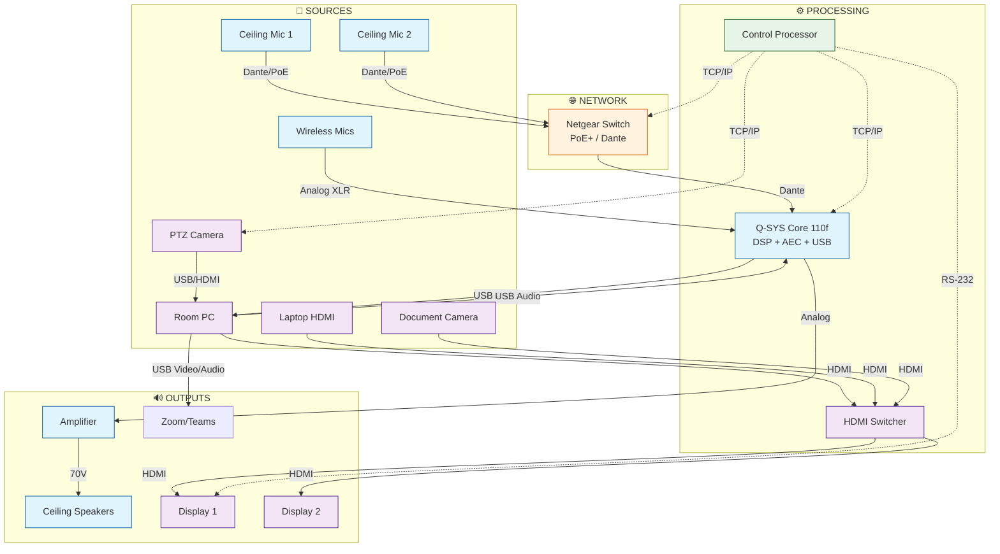

# Deliverable Format Templates

This document provides detailed templates for all four AV design deliverables: BOM, SOW, Signal Flow Diagram, and Rack Elevation.

## Deliverable A: Bill of Materials (BOM)

### Template

```markdown
## Bill of Materials (BOM)

**Project:** [Room Name/Number]
**Room Type:** [Classroom / Lecture Hall / Auditorium]
**Capacity:** [Number] seats
**Date:** [YYYY-MM-DD]

### Processing & Control

| Manufacturer | Model | Description | Qty | I/O & Compatibility Resolution |
|--------------|-------|-------------|-----|--------------------------------|
| [Mfr] | [Model] | [Description] | [#] | [How it connects, signal matching, power] |

### Audio

| Manufacturer | Model | Description | Qty | I/O & Compatibility Resolution |
|--------------|-------|-------------|-----|--------------------------------|
| [Mfr] | [Model] | [Description] | [#] | [How it connects, signal matching, power] |

### Video

| Manufacturer | Model | Description | Qty | I/O & Compatibility Resolution |
|--------------|-------|-------------|-----|--------------------------------|
| [Mfr] | [Model] | [Description] | [#] | [How it connects, signal matching, power] |

### Infrastructure & Rack

| Manufacturer | Model | Description | Qty | I/O & Compatibility Resolution |
|--------------|-------|-------------|-----|--------------------------------|
| [Mfr] | [Model] | [Description] | [#] | [How it connects, signal matching, power] |

### Summary

| Metric | Value |
|--------|-------|
| Total Rack Units | [X] RU |
| Estimated Power Draw | [X] W |
| PoE Devices | [X] |
| PoE Power Required | [X] W |
```

### I/O & Compatibility Resolution Format

Each entry in the I/O column should follow this pattern:

```
[Input Signal] → [Device] → [Output Signal] | [Power Source]

Examples:
Dante from MXA920 via PoE+ Switch Port 1 → Core 110f Dante IN 1-4 → USB to Room PC | AC Mains 65W
Core 110f Analog OUT → CXD4.3Q Analog IN → Speaker Wire to AD-C6T-LP | AC Mains 400W
Room PC HDMI → IN1808 HDMI IN 1 → HDBaseT OUT → HDBaseT Receiver → Display HDMI | AC Mains 35W
Netgear Switch PoE+ Port 8 → MXA920 Dante/Power | PoE+ 12W
```

### Example BOM Section

```markdown
### Processing & Control

| Manufacturer | Model | Description | Qty | I/O & Compatibility Resolution |
|--------------|-------|-------------|-----|--------------------------------|
| QSC | Q-SYS Core 110f | DSP with AEC and USB bridging | 1 | Dante IN from MXA920 mics (via switch); USB OUT to Room PC for Zoom; Analog OUT to amplifier; AC Mains 65W |
| Crestron | CP4N | Control processor | 1 | TCP/IP to Room PC, displays, projector; RS-232 to display; PoE+ from switch |
| Netgear | M4250-26G4XF-PoE+ | AV-Line managed switch | 1 | Gigabit Dante network; PoE+ to mics, cameras, control processor; AC Mains 480W (PoE budget 380W) |

### Audio

| Manufacturer | Model | Description | Qty | I/O & Compatibility Resolution |
|--------------|-------|-------------|-----|--------------------------------|
| Shure | MXA920 | Ceiling array microphone | 2 | Dante OUT to switch; PoE+ from switch Port 1,2; 12W each |
| QSC | CXD4.3Q | 4-channel amplifier | 1 | Dante IN from Core 110f; Speaker OUT to AD-C6T-LP ceiling speakers; AC Mains 400W |
| QSC | AD-C6T-LP | 6.5" ceiling speaker | 4 | 70V input from amplifier; distributed ceiling mount |

### Summary

| Metric | Value |
|--------|-------|
| Total Rack Units | 12 RU |
| Estimated Power Draw | 1,050 W |
| PoE Devices | 4 (2 mics + 1 camera + 1 control) |
| PoE Power Required | 49 W (25% headroom: 62 W) |
```

---

## Deliverable B: Statement of Work (SOW)

### Template

```markdown
## Statement of Work (SOW)

**Project:** [Room Name/Number]
**Room Type:** [Classroom / Lecture Hall / Auditorium]
**Capacity:** [Number] seats
**Date:** [YYYY-MM-DD]

### 1. Project Scope

[2-3 paragraphs describing the overall system architecture, primary capabilities, and use case]

#### System Architecture
[Description of signal flow topology and manufacturer ecosystem choice]

#### Primary Use Case
[Description of how the room will be used day-to-day]

#### Key Features
- [Feature 1]
- [Feature 2]
- [Feature 3]

### 2. Physical Installation & Infrastructure

#### Equipment Rack
- Location: [Closet / Back of room / Projection booth]
- Type: [Floor rack / Wall rack / Cabinet]
- Size: [X] RU
- Power: [Dedicated 20A circuit / Shared circuit]

#### Cable Pathways
- [Description of conduit, floor boxes, cable trays]

#### Display Mounting
- [Wall mount / Ceiling mount / Floor stand details]

#### Thermal Management
- [Rack ventilation requirements]
- [Room HVAC considerations]

### 3. Signal Flow Resolution & Programming

#### Network Architecture
- VLAN Configuration:
  - VLAN 10: Dante Audio (priority high, QoS DSCP 46)
  - VLAN 20: AV Control (priority medium)
  - VLAN 30: AV Streaming (priority medium)
- IGMP Snooping: Enabled on all VLANs
- Multicast: Enabled for Dante

#### Audio Processing
- DSP Configuration:
  - AEC Reference: USB playback from Room PC
  - EQ: Room tuning per manufacturer specifications
  - AGC: Enabled for microphone inputs
  - Routing: Microphones → AEC → USB Bridge (Zoom) + Amplifier (room speakers)

#### Video Distribution
- [HDMI / HDBaseT / SDVoP topology]
- [EDID management approach]
- [Resolution and HDCP handling]

#### Control System
- [Touch panel locations]
- [Button layout and automation sequences]
- [Scheduling integration]

### 4. Commissioning & Handover

#### Testing Procedures
- [ ] EDID handshake verification for all video paths
- [ ] AEC tuning with Zoom/Teams test call
- [ ] Microphone coverage pattern verification
- [ ] Speaker SPL measurement at listening positions
- [ ] Control system functionality test
- [ ] Network throughput and latency test

#### Documentation Deliverables
- [ ] As-built drawings
- [ ] DSP configuration backup
- [ ] Control system program files
- [ ] Network switch configuration backup
- [ ] Equipment manual compilation
- [ ] User quick-start guide

#### Training
- [ ] Instructor orientation (30 minutes)
- [ ] IT support training (2 hours)
- [ ] Maintenance procedures documentation
```

### Example SOW Section

```markdown
### 1. Project Scope

This project implements a HyFlex-capable AV system for Room 204, a 45-seat active learning classroom. The design prioritizes simultaneous in-person and remote instruction using Zoom Rooms integration with QSC Q-SYS native ecosystem.

#### System Architecture

The design uses QSC Q-SYS as the core processing platform, enabling native USB audio bridging for soft-codec applications without external hardware. Shure MXA920 ceiling microphones provide wide-area coverage with beamforming, connected via Dante to the Q-SYS Core. A single QSC PTZ 20 camera provides instructor tracking and student area coverage.

#### Primary Use Case

The room supports three modes of operation:
1. **Local Presentation:** Instructor presents from Room PC or laptop with audio through ceiling speakers
2. **HyFlex Instruction:** Remote students join via Zoom with full audio/video interaction
3. **Lecture Capture:** Class sessions recorded via Panopto integration for asynchronous viewing

#### Key Features

- Automatic microphone mixing with AEC for clear remote participant audio
- Single-button meeting start via Crestron touch panel
- Wireless presentation via Mersive Solstice for BYOD content sharing
- Scheduling display outside room showing availability
```

---

## Deliverable C: Signal Flow Diagram

### Mermaid Template



### Signal Flow Legend

| Line Style | Signal Type |
|------------|-------------|
| Solid line | Audio signal |
| Solid line | Video signal |
| Dashed line | Control signal |
| Color coding | See legend |

### Color Code

| Color | Signal Category |
|-------|-----------------|
| Blue | Audio |
| Purple | Video |
| Green | Control |
| Orange | Network |

---

## Deliverable D: Rack Elevation

### Template

```markdown
## Rack Elevation

**Rack Location:** [Room / Closet / Booth]
**Rack Type:** [Floor / Wall / Cabinet]
**Total RU:** [X]

### Equipment Layout (Top to Bottom)

```
┌────────────────────────────────────────────────────────────────┐
│ RU [XX]: [Device Name]                                         │
│          [Model] | [Power] | [Notes]                           │
├────────────────────────────────────────────────────────────────┤
│ RU [XX]: [Device Name]                                         │
│          [Model] | [Power] | [Notes]                           │
├────────────────────────────────────────────────────────────────┤
...
└────────────────────────────────────────────────────────────────┘
```

### Summary

| Metric | Value |
|--------|-------|
| Total RU | [X] |
| Equipment RU | [X] |
| Cable Mgmt RU | [X] |
| Available RU | [X] |
| Total Power | [X] W |

### Thermal Notes

- [Thermal management approach]
- [Expected heat load]
- [Ventilation requirements]

### Cable Management Notes

- [Vertical manager locations]
- [Service loop requirements]
- [Labeling scheme]
```

### Example Rack Elevation

```markdown
## Rack Elevation

**Rack Location:** Room 204 - AV Closet
**Rack Type:** Middle Atlantic MRK-2236 (Floor)
**Total RU:** 22

### Equipment Layout (Top to Bottom)

```
┌────────────────────────────────────────────────────────────────┐
│ RU 22:   Exhaust Fan Panel                                     │
│          Middle Atlantic | AC Mains 25W | 2x fans              │
├────────────────────────────────────────────────────────────────┤
│ RU 21:   Blank Panel (Ventilation)                             │
├────────────────────────────────────────────────────────────────┤
│ RU 20-19: QSC CXD4.3Q Amplifier                                │
│           4-channel Dante amp | AC Mains 400W | Speakers 1-4   │
├────────────────────────────────────────────────────────────────┤
│ RU 18:   Blank Panel (Ventilation)                             │
├────────────────────────────────────────────────────────────────┤
│ RU 17:   Q-SYS Core 110f                                       │
│           DSP/Control | AC Mains 65W | Dante + USB + Analog    │
├────────────────────────────────────────────────────────────────┤
│ RU 16:   Blank Panel (Ventilation)                             │
├────────────────────────────────────────────────────────────────┤
│ RU 15-14: Netgear M4250-26G4XF-PoE+                            │
│           AV-Line Switch | AC Mains 480W | Dante VLAN + PoE+   │
├────────────────────────────────────────────────────────────────┤
│ RU 13:   SurgeX SX-20                                          │
│           Power Conditioner | Pass-through | Surge protection  │
├────────────────────────────────────────────────────────────────┤
│ RU 12:   Blank Panel                                           │
├────────────────────────────────────────────────────────────────┤
│ RU 11-10: Crestron CP4N Control Processor                      │
│           4-Series | PoE+ 25W | TCP/IP + RS-232 + IR          │
├────────────────────────────────────────────────────────────────┤
│ RU 9:    Blank Panel                                           │
├────────────────────────────────────────────────────────────────┤
│ RU 8-7:  Extron IN1808 Switcher                                │
│           8-input scaler | AC Mains 40W | HDMI in/out         │
├────────────────────────────────────────────────────────────────┤
│ RU 6-1:  Cable Management / Patch Panels                       │
│           Dante patch, HDMI pass-through, Power strips         │
└────────────────────────────────────────────────────────────────┘
```

### Summary

| Metric | Value |
|--------|-------|
| Total RU | 22 |
| Equipment RU | 10 |
| Cable Mgmt RU | 6 |
| Available RU | 6 |
| Total Power | 1,035 W |

### Thermal Notes

- Exhaust fans at RU 22 pull hot air up and out
- Blank panels above heat-generating equipment ensure airflow
- Estimated heat load: 3,530 BTU/hr
- Room HVAC must accommodate additional load

### Cable Management Notes

- Vertical cable managers on both sides of rack
- Service loops at each device (8" minimum)
- Labeling format: [SOURCE]-[PORT] → [DEST]-[PORT]
- Color coding: Blue=Audio, Yellow=Video, Green=Control, Gray=Network
```

---

## Compatibility Validation Log

Include this table when generating BOM to document signal compatibility checks:

```markdown
### Compatibility Validation Log

| Connection | From | To | Signal | Bridge | Status |
|------------|------|-----|--------|--------|--------|
| Mic 1 to DSP | MXA920 Dante | Core 110f Dante IN | Dante | None | ✓ Direct |
| DSP to Amp | Core 110f Analog | CXD4.3Q Analog | +4 dBu | None | ✓ Direct |
| Amp to Speaker | CXD4.3Q 70V | AD-C6T-LP | 70V | None | ✓ Direct |
| PC to Switcher | Room PC HDMI | IN1808 HDMI IN | HDMI 2.0 | None | ✓ Direct |
| Switcher to Display | IN1808 HDMI OUT | LG Display HDMI | HDMI 2.0 | None | ✓ Direct |
| Camera to PC | PTZ 20 USB | Room PC USB 3.0 | USB 3.0 | None | ✓ Direct |
```
